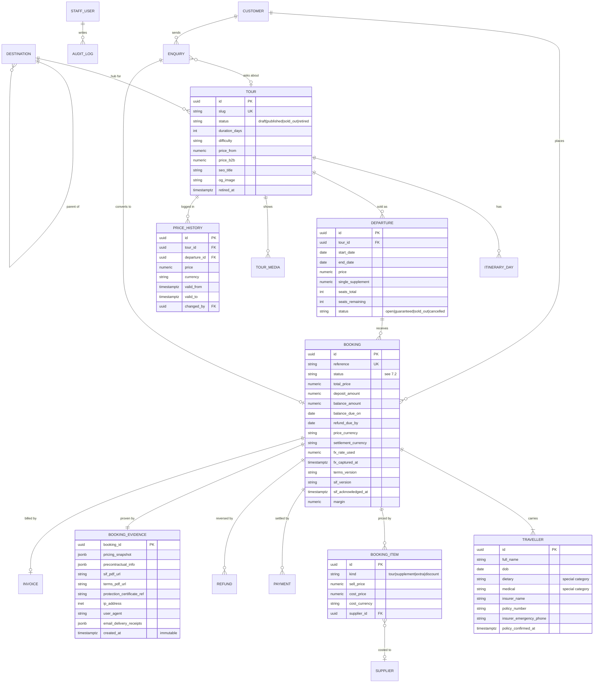

# Atlas — Tourism Website Specification

Draft 1 · Research-derived · All figures EUR, 2026

> **Unconfirmed assumptions baked into this draft.** You have not yet told me where Atlas is established, what it sells, or which markets it targets. This document assumes a **multi-day tour operator, EU/Balkan-established, selling into the EU** — because that is the most-regulated realistic case and therefore the safest default to plan against. North Macedonia appears throughout as the worked example for non-EU establishment. **If any of that is wrong, Parts 2, 9 and 12 change materially.** See Part 15.
>
> Regulatory and SEO claims carrying specific 2026 dates came from web research during drafting. Treat them as leads to verify, not as settled fact — especially anything in Part 12.

---

## Part 0 — Direct answers to your four questions

**1. What do tourism agency websites have in common?** Ten things. Copy all ten; the rest is decoration.

| # | Pattern | Why it exists |
|---|---|---|
| 1 | Tour detail page as the product page: gallery, day-by-day itinerary, inclusions/exclusions, departure+price table, FAQ, reviews | It is the only page that converts. Everything else feeds it |
| 2 | Faceted destination hubs (`/destinations/morocco`) with 300–800 words of real editorial | Ranks, and funnels to tours |
| 3 | An **enquiry path running alongside booking** — form, phone, WhatsApp, callback | 60–85% of multi-day revenue closes by conversation, not checkout |
| 4 | **Deposit, not full payment**, at the point of commitment | Removes the €2,000 objection |
| 5 | Trust furniture: licence numbers, bonding/insolvency provider named, third-party review score, real team photos | Travel is a high-trust prepayment purchase |
| 6 | A "why book with us / financial protection" page | Usually the second-highest-converting page on the site |
| 7 | Blog as a topic-cluster SEO engine, not a news feed | Cheap traffic against expensive PPC |
| 8 | Prices shown as "from €X" with duration and next departure on every card | Filters out unqualified enquiries |
| 9 | Practical info (visa, best time to visit, safety, packing) on the destination hub | Long-tail traffic and LLM citation |
| 10 | Dated, versioned booking conditions linked from the footer | Regulatory requirement and a conversion asset |

**2. What features does Atlas need?** At launch: a fast, fully indexable catalogue (tours, destinations, blog), an enquiry route that reaches a human within an hour, a deposit payment link, and a back office where your own staff edit tours and departures without calling a developer. That is the MVP in Part 5. Everything else — quote builder, wishlists, instant-book, multi-language, supplier margins — is post-launch, funded by revenue, prioritised by what your ops team actually complains about.

**3. Does Atlas need an admin panel?** Yes, and it is non-negotiable — but a small one. Payload CMS gives you tours, departures, media, blog, pages, bookings and enquiries out of the box. Your staff edit content themselves; no developer in the loop for prices, dates, photos or copy. What you do **not** need at launch: a ten-tab tour editor, an enquiries kanban with SLA tracking, a permissions matrix with six roles, or a pricing rules engine. Three tabs, two roles, one price column per departure.

**4. Do customers need accounts and logins?** **No. Explicitly no.** Guest checkout only. No customer passwords, no password-reset support burden, no account-takeover surface, no GDPR credential store. Travellers reach their trip at `/my-trips` via an **expiring magic link tied to `booking_id`**, sent in the confirmation email. Staff log in with mandatory MFA. Customer accounts are a V2 decision, justified only by wishlist and repeat-booking data you do not yet have. This is a deliberate answer, not an omission.

---

## Part 1 — The two forks that determine everything else

Answer these before a line of code. They move the budget by six figures and the launch date by three months.

| Fork | Option A | Option B | What it changes |
|---|---|---|---|
| **What do you sell?** | Day trips only, no accommodation, <24h | Multi-day packages (transport + accommodation) | Option A: the Package Travel apparatus does not apply — **~€8–15k of legal and compliance cost disappears**, insolvency protection may not be required, OTA channels (Viator/GetYourGuide) become your primary revenue and Bókun moves from LATER to MVP. Option B: everything in Part 12 applies, insolvency protection is a hard launch blocker with a 4–12 week clock |
| **Where is Atlas established, and where do you sell?** | North Macedonia / non-EU Balkan entity | EU entity (BG/SI/HR subsidiary) | Determines your acquirer (Stripe is unavailable in NM, RS, AL, ME, BA, XK), your settlement currency, whether the PTD applies directly or via the targeting test, which insolvency regime binds you, and your VAT/TOMS treatment |

If you sell both, the multi-day rules bind you and the day-tour economics apply on top. Assume Option B for both unless you tell me otherwise.

---

## Part 2 — Buy vs build: decide this in week 1

You are not buying a website. You are buying inventory software with a marketing front end. The question is which half you own.

### 2.1 The three routes, with real numbers

| | **WordPress** | **Custom Next.js (trimmed)** | **SaaS engine + marketing site** |
|---|---|---|---|
| What it is | WP + custom theme (ACF/Blocks) + a booking plugin; enquiry-led with Stripe/acquirer deposits | Part 5's MVP: bespoke catalogue + admin, hosted checkout | Booking engine as a service, linked or embedded from a fast Astro/WP marketing site |
| **Build cost** | **€6–18k** (€6–10k theme-based, €12–18k custom theme + custom booking flow) | **€28–45k trimmed**; **€70–150k as originally specced** | **€3–9k** (15–25 pages, design + content build) |
| **Timeline** | **5–9 weeks** | **14–18 weeks trimmed**; 6–9 months as specced | **3–5 weeks** |
| Infra / licences per month | €70–190 | **€150–450** | €60–150 + SaaS |
| SaaS fee per month | — | — | **€0–400** |
| Booking fees | acquirer 1.5–2.9% (Balkan acquiring 2.5–6%) | same | same **+1.5–6% platform fee** |
| Maintenance retainer | **€200–600/mo** | **€800–2,000/mo** | **€150–400/mo** |
| **Realistic year-1 total** | **€12–30k** | **€40–70k** | **€8–22k** |
| Breaks when | >€1.5M turnover, real inventory constraints, complex multi-variant pricing | Never — but you paid for that | The vendor cannot model your product, or you need the booking flow fully on-brand |

### 2.2 Break-even: when does building pay back?

Trimmed custom build at **€45k capex + €1,200/mo retainer = €59k year one, €14.4k/yr thereafter.** SaaS at €200/mo + 2% of gross booking value:

| Annual GBV | SaaS cost/yr | Custom cost/yr (yr 2+) | Verdict |
|---|---|---|---|
| €300k | €8.4k | €14.4k | **Buy.** Not close |
| €750k | €17.4k | €14.4k | **Buy** — the €45k capex has not paid back |
| €1.5M | €32.4k | €14.4k | Payback ≈ 2.5 yrs. Borderline |
| €3M | €62.4k | €14.4k+ | **Build starts making sense** |

### 2.3 Atlas should NOT build its own booking engine if any of these are true

- Turnover under ~**€1.5M**
- Fewer than ~**40 bookings/month** (€600k ÷ €1,900 average booking ≈ 310/yr ≈ 6/week — you would be building distributed inventory locking for six transactions a week)
- Fewer than ~**30 SKUs**
- **No in-house or retained developer.** Bus factor 1 on bespoke money-handling code is the single largest risk in this document
- The product is **enquiry-led** — which multi-day tours overwhelmingly are

Under those conditions the booking engine is not the constraint on revenue. **Content and traffic are.** Own the catalogue, the content and the enquiry flow — the parts where being bespoke actually earns something. Rent the money-handling.

### 2.4 If you buy: the shortlist depends on what you sell

Bókun, Rezdy, Checkfront, FareHarbor and Peek are **activity/day-tour** platforms — timeslots, per-person, pay-in-full, OTA distribution. They handle multi-day packages (deposits, balance schedules, rooming, single supplements, traveller forms, per-departure manifests) badly or not at all.

| Vendor | Fit | Indicative cost |
|---|---|---|
| **WeTravel** | Multi-day operators. Deposits + payment plans native. Best value on this list | €0/mo, 0% on bank transfer, ~2.9% card |
| **TourCMS / Tourwriter / YouLi** | Multi-day and tailor-made | €50–300/mo |
| **Lemax / Tourplan** | Real tour-operator systems for €2M+ operators | €400–1,500/mo |
| **Bókun / Rezdy / FareHarbor** | Correct **only** if day tours are the business — then they are also your OTA channel manager | 1.5–6% of GBV |

Verify current pricing directly; it moves annually.

### 2.5 The riskiest thing you could build

Bespoke money-handling code — holds, a pricing resolver, deposit/balance schedules, dunning, refunds, webhook idempotency — maintained by one person for six bookings a week. Every bug in that layer is not a bug, it is a **financial and legal incident**: a double charge, a lost deposit, a refund that misses the Package Travel Directive's 14-day window, a manifest that does not match what the customer paid for. There is no second pair of eyes and no vendor to escalate to. The mitigation is not more tests. It is **not owning that code**: hosted checkout redirect + payment links at MVP, or a SaaS engine.

---

## Part 3 — Contested calls, resolved

Where the completeness review and the pragmatism review disagree, here is the ruling and the reasoning. The unifying principle: **schema is cheap and catastrophic to retrofit; UI is expensive and safe to defer.** Put the columns in now, build the screens later.

| # | Contested | Completeness says | Pragmatism says | **Ruling** |
|---|---|---|---|---|
| 1 | Supplier cost lines & margin | MVP — without `cost_price`/`supplier_id` your first TOMS VAT return is unfilable | V2 — small operators cost in spreadsheets | **Split. MVP: the columns** (`booking_item.cost_price`, `cost_currency`, `supplier_id`, booking-level `margin`) **plus a CSV export.** V2: the supplier module, cost entry UI, margin reporting. Cost ≈ 1 day now vs a data-archaeology project later |
| 2 | Roles + audit log | Full RBAC, step-up MFA on sensitive reads | Two roles, MFA on login, no audit | **Three roles + append-only `audit_log` table written by a DB trigger.** No permissions UI, no step-up. The table is ~2 hours and is your chargeback and GDPR evidence; the admin screen is V2 |
| 3 | `booking_evidence` immutable store | MVP — a booking that cannot prove what the traveller was shown loses both the chargeback and the regulator's file | Filed under V2 ceremony | **Completeness wins. MVP.** It is one JSON snapshot written on booking confirmation, half a day of work, and it is the legal core of the product |
| 4 | `price_history` table | MVP — Omnibus 30-day reference pricing is otherwise an intention, not a control | Promo/deals machinery is unused | **MVP for the table** (DB trigger on every price mutation). The Deals page and any "was/now" component is **V2** — but when it ships it reads `lowest_price_last_30d`; discount copy is generated, never typed |
| 5 | Pricing resolver, `price_rule` engine, seasonal × occupancy matrix | — | Cut; `departures.price` + `single_supplement` covers 90% | **Cut.** Per-departure pricing. Revisit when someone genuinely cannot express a price |
| 6 | Holds with `SELECT … FOR UPDATE`, availability ledger, RRULE materialisation | — | Cut at this volume | **Cut at MVP** (request-to-book means staff confirm the seat). Reinstate on the day instant-book ships for a real multi-day SKU |
| 7 | Lighthouse CI + axe CI failing the build | — | Reporting only; it becomes `--ignore` within three weeks | **Reporting jobs, manual pre-launch gate** — with one exception: **block publish if a hero image exceeds 200 KB.** That single gate captures most of the win |
| 8 | 10–20 destination×theme pages at launch | Highest-ROI page type | Thin-content trap | **Build one only where you have 3+ real tours to list.** Five strong ones beat eighteen with two tours each. Target 5–8 at launch, 15–20 by month 9 |
| 9 | Crisis / mass-cancellation tooling | MVP — the 14-day refund deadline is law | Not mentioned | **Split. MVP: bulk-cancel a departure** (generate refunds, queue emails, write audit entries), **a `refund_due_by` column on the bookings list counting down the 14-day clock**, and an editable site-wide incident banner. **V2:** reason-code reporting, complaints SLA workflow |
| 10 | Accessibility scope | Full WCAG 2.2 AA programme | Check the EAA microenterprise exemption first | **Both. Build to WCAG 2.2 AA discipline** (2 days of habit, not a workstream) **but scope the paid audit by exemption status**: €1,500–3,000 focused audit of the booking flow if exempt, €5–8k full-site if not |
| 11 | Gotenberg, ClamAV, BlurHash, Neon branch-per-PR | Implied in the stack | Cut all four | **Cut all four.** Hosted PDF API (~$20/mo); nothing to virus-scan once you decline to store passport scans; `width`/`height` plus a dominant-colour background gets you BlurHash's CWV benefit in 20 minutes |
| 12 | Multi-language sidecar tables | V2 | Don't build the tables until translation is paid for | **Fix the URL scheme (`/en/`) at MVP** — that is the expensive-to-retrofit half. Build the tables when a translation invoice exists |
| 13 | 10 transactional emails | — | You need 4 | **Four at MVP**: enquiry received, deposit received (+ ATOL certificate if applicable), balance due, pre-departure. The rest are V2 |

---

## Part 4 — Cost, timeline and lead times

### 4.1 The arithmetic problem in the original plan

The draft claimed MVP = 14 weeks at €25–60k. The same table contained 5× L (≥3 weeks) + 4× M (1–3 weeks) + 1× S = **20–28 dev-weeks at the theoretical floor**, before PM, QA, design revisions, content loading, client review or a single bug. Realistic solo delivery: **30–40 weeks, €72–144k freelance, €120–210k agency.** €60k ÷ €100/hr = 600 hours = 15 dev-weeks: the *top* of the stated budget bought the *minimum theoretical* effort with zero slack.

The scope in Part 5 is the fix. It ships in **14–18 weeks at €28–45k**.

### 4.2 Build cost

| Line | Low | High | Note |
|---|---|---|---|
| Custom MVP build (Part 5 scope) | €28,000 | €45,000 | 14–18 weeks, 1 full-stack dev + part-time designer |
| Same scope as originally specced | €70,000 | €150,000 | 6–9 months. Do not buy this |
| WordPress alternative | €6,000 | €18,000 | 5–9 weeks |
| SaaS + marketing site alternative | €3,000 | €9,000 | 3–5 weeks |
| **Content production** (outsourced, ~45–60k words) | €5,000 | €14,000 | €0.10–0.25/word. **Not optional and not currently in anyone's budget** |
| Photography — licensed stock/library | €200 | €900 | Wrong-country stock is noticed by customers and reviewers |
| Photography — commissioned shoot | €1,500 | €6,000 | |
| Migration of existing tours out of Word/spreadsheets/Dropbox | €1,200 | €3,000 | 20–40 hours of unglamorous data entry. Name an owner |
| Booking conditions — **first draft** by a travel-law specialist | €1,500 | €4,000 | 2–4 weeks turnaround. The €800–3,000/yr line elsewhere is for an annual *review*, not a first draft |
| Accessibility manual audit — focused (booking flow) | €1,500 | €3,000 | If the EAA microenterprise exemption applies |
| Accessibility manual audit — full site + remediation | €5,000 | €8,000 | If it does not |
| Accounting export — CSV at MVP | €500 | €500 | Every operator asks for this in week 3 post-launch |
| Accounting export — real integration | €3,000 | €6,000 | V2 |
| Developer handover ramp if the original dev goes quiet | €6,000 | €12,000 | ~3 weeks. This is what bus-factor-1 costs |

### 4.3 Running cost

| Item | Per month (EUR) |
|---|---|
| Hosting (Vercel Pro / managed app hosting) | 20–60 |
| Database (Neon/Supabase/RDS) | 25–100 |
| CDN + WAF (Cloudflare) | 0–25 |
| Object storage + image delivery (R2) | 0–5 |
| Transactional email (Postmark/Resend) | 15–50 |
| Cookie consent tool | 15–50 |
| Error + uptime monitoring (Sentry + UptimeRobot) | 25–60 |
| Hosted PDF API | ~20 |
| Off-provider backups | 5–20 |
| Review platform (Feefo/Trustpilot paid tier) | 0–250 |
| Rank tooling (Ahrefs/Semrush) | 0–120 |
| **Subtotal — infrastructure** | **€150–450** |
| Developer maintenance retainer (honest price for this stack) | **800–2,000** |
| SEO/content (writer, 2 posts + optimisation, ~20 hrs) | 400–1,500 |
| **Total running cost** | **€1,350–3,950/mo** |

**Annual and transactional**

| Item | Cost |
|---|---|
| Domain + SSL | €15–50/yr |
| Legal review of booking conditions | €800–3,000/yr |
| Accessibility manual audit | €1,500–5,000/yr |
| PCI SAQ A self-assessment | €0 (self-serve) |
| **Insolvency protection / bond / trust** | Typically **1–3% of turnover**, or a fixed bond premium |
| ATOL licence (UK, if flight-inclusive) | APC ~£2.50/passenger + licence fees |
| Payment processing | 1.5–2.9% + €0.25; **Balkan local acquiring 2.5–6%** |

**Rule of thumb to quote: infrastructure €150–450/month; total running cost including retainer and content €1,350–3,950/month.** The €300–1,200/mo retainer figure in the draft was priced for a WordPress site and buys an undefined obligation. See §14.2 for what a retainer must actually specify.

### 4.4 Lead times — these are queues, not tasks

| Item | Lead time | Start |
|---|---|---|
| **Insolvency protection / bond / trust account** | **4–12 weeks.** Requires filed accounts, often a personal guarantee | **Week 1, before any code.** You cannot legally take a deposit without it |
| **ATOL** (if flight-inclusive) | **8–12+ weeks.** Dictates the launch date on its own | Week 1 |
| Acquiring / merchant account decision (Part 9.1) | 2–8 weeks | Week 1 — the data model cannot be frozen before it |
| Travel-law specialist: booking conditions first draft | 2–4 weeks | Week 3 |
| **Content production** | **8–16 weeks, and it is the #1 cause of launch slip — every single time** | Week 1, in parallel. Gate: **five pilot tours fully written and photographed by week 6**, or the launch date moves |
| Google Business Profile verification | 1–3 weeks (postcard) | Week 8 |

### 4.5 Content is the critical path; code is not

The pre-launch checklist demands 15–25 tours, 8–12 destination hubs, 10–20 destination×theme pages and 6–10 blog posts — roughly **60–80 pages, 45–60k words and 150–250 licensed photographs**, produced by a marketing function that is one person at 30% time. The site sits finished and unlaunched while somebody writes itineraries.

**Do this instead:** contract the content in parallel from week 1, budget €5–14k, name **one** owner at the agency, and **launch with 8–12 tours and 4–5 destination hubs.** Twenty-five tours is a month-4 milestone, not a launch requirement. The per-tour completeness checklist moves from V2 into **MVP** — it is the only mechanism that stops half-finished tours going live.

---

## Part 5 — Scope

### 5.1 MVP — 14–18 weeks, €28–45k

| Workstream | Ships |
|---|---|
| **Foundations** | Next.js + Payload + Postgres, CI (typecheck, lint, Playwright smoke, Lighthouse + axe as **reporting** jobs), staging with basic auth + `noindex`, Sentry, UptimeRobot, Cloudflare |
| **Data model** | Part 7 in full, including the "cheap now, catastrophic later" columns: cost/margin, `price_history`, `booking_evidence`, FX fields, insurance fields, `price_b2b` |
| **Admin — content** | Tour editor, **3 tabs** (basics, itinerary, photos) + drag-reorder itinerary builder, duplicate, archive, draft/published/sold_out/retired, per-tour completeness checklist, media library with enforced alt text, destinations, blog, pages, redirects manager |
| **Admin — ops** | Departures (date, price, single supplement, seats, status) + CSV import · bookings list/detail/manual create · **bulk-cancel a departure** · `refund_due_by` countdown column · manifest export · **bookings CSV export for the bookkeeper** · enquiries list with a "convert to booking" button · incident banner · 3 roles + audit table |
| **Public site** | Homepage · tour listing, 4 facets (destination, theme, duration, price) + shareable URLs · tour detail (gallery, day-by-day, inclusions/exclusions, dates+prices, FAQ, reviews, sticky enquiry CTA) · 5–8 destination hubs · 5–8 destination×theme pages **with 3+ tours each** · blog · about/team · contact · legal set · financial-protection page · site search · 404 |
| **Booking & payments** | **Enquiry form as the primary conversion** + WhatsApp click-to-chat + callback request · hosted-redirect checkout for **deposits**, generated by staff against a booking record · balance by re-sent expiring payment link at T-60/T-45/T-30 · webhook handling with idempotency · **no cart, no seat locking, no instant-book, no stored cards** |
| **Accounts** | Guest checkout · `/my-trips` via expiring magic link scoped to `booking_id` · staff auth with mandatory MFA |
| **Media** | Presigned direct-to-R2, sharp resize ladder, hero preload, dominant-colour placeholder |
| **Ops & comms** | 4 transactional emails · voucher/invoice/trip-notes PDFs via hosted API · newsletter capture synced to Mailchimp/Brevo (4 hours, do not skip) |
| **SEO & compliance** | JSON-LD from the data model, sitemap index, robots, canonicals, meta fields, GBP, GA4 + Consent Mode v2 (14-month retention, BigQuery export on day one), cookie tool, WCAG 2.2 AA build discipline + one focused audit, all legal documents, Standard Information Form with stored acknowledgement |

**MVP non-goals (explicit):** no cart · no instant-book on multi-day · no customer accounts · no comparison tool · no dark mode · no live-visitor counters · no AI chatbot · no infinite scroll · no accommodation tab · no first-party review system · no promo codes · no wishlist · no Trip Finder quiz · no brochure gate · no `llms.txt` · no orphan detection · no server-side GTM · no image sitemap · no offline conversion import.

### 5.2 V2 — post-launch, funded by revenue, in priority order

| # | Feature | Effort |
|---|---|---|
| 1 | **Quote builder** with a `public_token` accept-and-pay-deposit page — highest-revenue back-office feature for tailor-made | M |
| 2 | **OTA channel manager (Bókun) — move to #1 if you sell day tours.** OTA revenue often exceeds direct in year 1 | M |
| 3 | Abandoned-enquiry recovery (1h/24h/72h sequence with resume link) | S |
| 4 | **B2B agent rate sheet** behind a login, reading the `price_b2b` column shipped at MVP | S |
| 5 | Accounting integration (from the MVP CSV) | M |
| 6 | Supplier records + cost entry UI → margin per departure; guide/vehicle assignment | M |
| 7 | First-party reviews verified by `booking_id`, sub-ratings, operator replies | L |
| 8 | Accommodation tab with named hotels + caveats | M |
| 9 | Multi-language (sidecar tables, hreflang, ~20 commercial pages, human translation) | L |
| 10 | Extensions / add-ons and priced extras at checkout; room-configuration builder | M |
| 11 | Deals page reading `lowest_price_last_30d`; similar-trips and sold-out cross-sell; recently viewed | M |
| 12 | Version history, scheduled publish, bulk edit; campaign landing-page builder | M |
| 13 | Report suite: departure profitability, lead funnel, LTV, pacing | M |
| 14 | Offline conversion import to Google Ads; server-side GTM; Looker Studio dashboard | M |
| 15 | Waitlist; `ON_REQUEST` capacity mode; availability ledger; RRULE departures | M |
| 16 | Traveller messaging thread; live chat (only if staffed) | S |
| 17 | Complaints inbox with SLA tracking; voucher-vs-cash refund UI (**mandatory 2029, see §12.1**) | M |
| 18 | Customer accounts — **only if** wishlist/repeat-booking data justifies them | M |

### 5.3 LATER, or never

**When the business demands it:** supplier extranet · instant-book across the full multi-day catalogue · flights via Duffel (only if flight-inclusive revenue exceeds ~30%) · e-signature for waivers · native guide check-in app · gift vouchers · loyalty and referral credits.

**Deliberately never:** dark mode (it fights the photography) · side-by-side comparison (low single-digit real usage) · live "X people viewing" counters · Facebook login · a from-scratch admin framework · GDS/bedbank integration at this scale · self-hosted adaptive-bitrate video · **an accessibility overlay**.

---

## Part 6 — Page inventory

| Path | Template | Pri | Indexable | Notes |
|---|---|---|---|---|
| `/` | Homepage | M | Yes | Hero, 6–8 featured tours, 4 destination tiles, trust bar, newsletter |
| `/tours` | Listing | M | Yes | 4 facets, 3 sorts, shareable URLs, `?page=` pagination |
| `/tours/{slug}` | Tour detail | M | Yes | The product page. `Product`+`Offer`+`TouristTrip` |
| `/destinations` | Index | M | Yes | |
| `/destinations/{country}` | Hub | M | Yes | 300–800 words editorial, tour grid, best-time-to-visit table, practical info, FAQ, related posts |
| `/destinations/{country}/{theme}` | Intersection | M | Yes | **Only where 3+ tours exist.** 5–8 at launch |
| `/destinations/{country}/{city}` | Sub-hub | V2 | Yes | |
| `/collections/{slug}` | Curated | V2 | Yes | |
| `/deals` | Deals | V2 | Yes | Must read `lowest_price_last_30d` |
| `/blog`, `/blog/{slug}` | Blog | M | Yes | `BlogPosting` + real author bio page |
| `/about`, `/team`, `/team/{person}` | About | M | Yes | Author entities matter for travel E-E-A-T |
| `/financial-protection` | Trust | M | Yes | Second-highest-converting page. Licence numbers, bond provider, what your money is protected by |
| `/contact` | Contact | M | Yes | Form + phone + WhatsApp + callback |
| `/faq` | FAQ | M | Yes | |
| `/enquiry`, `/enquiry/thanks` | Enquiry | M | No (`noindex,follow` on thanks) | The primary conversion |
| `/checkout/{token}`, `/checkout/confirmation` | Payment | M | No | Hosted redirect |
| `/my-trips/{magic_token}` | Traveller portal | M | No | Balance, documents, traveller forms, checklist |
| `/search` | Site search | M | `noindex,follow` | Postgres `tsvector` + `pg_trgm` |
| `/legal/privacy`, `/cookies`, `/terms`, `/booking-conditions`, `/cancellation-policy`, `/imprint`, `/accessibility` | Legal | M | Yes | Dated and versioned |
| `/admin/*` | Payload | M | No | `Disallow` in robots.txt |
| `/404`, `/500` | Error | M | No | 404 carries search + top destinations |

---

## Part 7 — Data model

### 7.1 Entity relationships



### 7.2 Booking status enum

| Status | Meaning | Entered by | Side effects |
|---|---|---|---|
| `ENQUIRY` | Interest captured, no commitment | Public form | `gclid` stored; enquiry email to ops |
| `QUOTED` | Staff has priced it | Staff | Quote PDF; `public_token` issued (V2) |
| `PENDING_DEPOSIT` | Payment link sent, unpaid | Staff | Link expires in 72h; auto-reverts to `QUOTED` |
| `CONFIRMED` | Deposit received | Webhook | **Writes `booking_evidence`**; confirmation email; ATOL certificate if applicable; seat decrement |
| `BALANCE_DUE` | T-60 reached | Cron | Balance link at T-60/T-45/T-30; unpaid queue in admin |
| `PAID_IN_FULL` | Balance settled | Webhook | Trip notes + final documents released to `/my-trips` |
| `TRAVELLED` | Departure date passed | Cron | Review invitation keyed to `booking.id`; health/dietary purge scheduled +90d |
| `COMPLETED` | Financials closed | Staff | Margin finalised; feeds reporting |
| `CANCELLED_BY_CUSTOMER` | Traveller cancelled | Staff | Termination fee applied from the published scale; `refund_due_by = now + 14d` |
| `CANCELLED_BY_OPERATOR` | Min numbers, supplier failure, force majeure | Staff / bulk-cancel | **Full refund**, `refund_due_by = now + 14d`, reason code, notification queued |
| `REFUNDED` | Money returned | Webhook | Clears the SLA timer; GA4 `refund` event |
| `EXPIRED` | Quote lapsed | Cron | Feeds abandoned-recovery (V2) |
| `NO_SHOW` | Did not travel | Staff | No refund; retained for reporting |

Enforce transitions in the database (`CHECK` constraint or a status-transition table), not only in application code.

### 7.3 Non-negotiable model rules

- **Immutability:** `booking_evidence` and `invoice` rows are insert-only; `REVOKE UPDATE, DELETE` from the application role.
- **Gapless sequential invoice numbering** — a database sequence, never application-generated, never reused. Required for TOMS and for local fiscalisation regimes.
- **Currency:** every booking stores `price_currency`, `settlement_currency`, `fx_rate_used`, `fx_captured_at`. See §9.4.
- **`price_history` is written by a trigger**, not by the application, on every price mutation.
- **Deletion is partial by design** — `users.deleted_at` plus an anonymisation job. See §12.4.

---

## Part 8 — Admin panel and roles

Payload CMS. Three roles plus a break-glass developer account. No permissions UI at MVP; roles are a config constant.

| Capability | Owner/Admin | Ops/Sales | Marketing | Developer (break-glass) |
|---|---|---|---|---|
| Create/edit/publish tours, destinations, blog, pages | ✅ | ✅ | ✅ | ✅ |
| Upload media, edit alt text and SEO fields | ✅ | ✅ | ✅ | ✅ |
| Create/edit departures, seats, dates | ✅ | ✅ | ❌ | ✅ |
| Change prices | ✅ | ✅ | ❌ | ⚠️ audited |
| View bookings (incl. traveller PII) | ✅ | ✅ | ❌ | ⚠️ audited |
| Create/amend bookings, send payment links | ✅ | ✅ | ❌ | ⚠️ audited |
| Issue refunds, bulk-cancel a departure | ✅ | ⚠️ ≤ deposit | ❌ | ❌ |
| Export manifests / bookings CSV | ✅ | ✅ | ❌ | ✅ |
| Edit legal pages, booking-conditions version | ✅ | ❌ | ❌ | ❌ |
| Run GDPR export / anonymisation | ✅ | ❌ | ❌ | ⚠️ audited |
| Manage staff users and roles | ✅ | ❌ | ❌ | ✅ |
| Read `audit_log` | ✅ | ❌ | ❌ | ✅ |

MFA is mandatory on every staff account. Every ⚠️ row writes an `audit_log` entry with actor, timestamp, IP and before/after values.

---

## Part 9 — Money

### 9.1 Acquiring — decide in week 1, before the data model is frozen

**Stripe does not operate in North Macedonia, Serbia, Albania, Montenegro, Bosnia or Kosovo. PayPal in North Macedonia is send-only — it cannot receive.** Every downstream design decision (deposit/balance mechanics, refunds, PCI scope, dunning, chargeback evidence, fraud screening) depends on this answer.

| Option | What you get | What you lose | Verdict |
|---|---|---|---|
| **(a) Local acquirer** (CaSys, Halkbank, NLB, Stopanska, ProCredit) with a **hosted redirect** page | Keeps PCI SAQ A; works with a domestic entity | MKD settlement · no stored-card off-session charging · no Radar-equivalent fraud screening · hand-rolled refund flows · weaker 3DS tooling | Viable if the customer base is regional |
| **(b) EU subsidiary (BG/SI/HR) as the contracting entity** | Stripe/Adyen/Mollie · EUR settlement · 3DS · Radar · payment links · mature refund and dispute APIs | A second VAT registration · an EU insolvency-protection regime · corporate cost | **Recommended if >40% of bookings are inbound from EU/UK/US** |
| **(c) Merchant-of-record platform** | Fastest to launch, VAT handled | **Most MoR AUPs exclude travel services** | Only after written confirmation from the vendor that travel is permitted |

### 9.2 Deposit → balance without stored cards

Charging a balance later against a stored card requires taking the card **on-session with an explicit stored-mandate acceptance** (mandate text + version stored against the booking), flagging the later charge as merchant-initiated, and accepting that a share of off-session charges will be declined or forced into a 3DS challenge.

**Recommendation: do not architect around stored cards at all.** Collect the balance via a **re-sent expiring payment link at T-60/T-45/T-30**, backed by a staff-visible "unpaid balance" queue. This is mandatory rather than optional if you land on a local acquirer, which will not support off-session merchant-initiated transactions.

### 9.3 Refunds and the 14-day clock

Cancellation sets `refund_due_by = cancelled_at + 14 days`. The bookings list shows days remaining as a sortable column with a red state under 4 days. Bulk-cancel on a departure generates refunds for every booking on it, queues the notification, and writes audit entries — one earthquake, flood or airline collapse otherwise turns this into a spreadsheet-and-panic week.

### 9.4 Currency — decided, not discussed

**Set and charge in one settlement currency.** Display other currencies as clearly-labelled approximations from a server-cached daily rate. **Never let a converted figure be the contractual price** — under the PTD price-revision rule (§12.1), an FX-driven number that moves between quote and confirmation is a price increase you did not reserve the right to make. State in the booking conditions that the contract price is the settlement-currency amount. Never auto-redirect by IP; show a dismissible banner.

### 9.5 PCI-DSS — target SAQ A, never touch card data

Under **PCI DSS v4.0.1**, requirements 6.4.3 (payment-page script inventory) and 11.6.1 (tamper detection) were removed from SAQ A but replaced by an eligibility criterion: the merchant must confirm their site is not susceptible to script attacks affecting the e-commerce system.

- **Full redirect** (hosted checkout on the provider's domain) → simplest scope. **Ship this at MVP.**
- **Embedded iframe** → better UX, but you must obtain written confirmation from the provider that their embedded solution includes script-attack protections when implemented per instructions, **and/or** implement a strict CSP `script-src` allowlist + SRI + a script inventory. Not worth it at MVP.
- Complete SAQ A annually; keep the AOC where finance can find it. Never log, store or email PAN/CVV.

---

## Part 10 — Content and SEO

### 10.1 URL and information architecture

```
/destinations/morocco                        (hub)
 ├── /destinations/morocco/marrakech
 ├── /destinations/morocco/hiking            (only with 3+ tours)
 ├── /tours/atlas-mountains-trek-8-days      (×N)
 └── /blog/best-time-to-visit-morocco
```

Enforced: every tour links **up** to its destination hub and **sideways** to 3 similar tours; every blog post links to exactly one hub and 1–3 tours with **descriptive anchor text**; breadcrumbs on every page as real links matching `BreadcrumbList`. Orphan detection is V2.

Destination hub contents: single H1 · 300–800 words written by a human who has been there (AI destination boilerplate is what everyone else already has) · tour grid with price-from, duration, rating, next departure, **server-rendered** · best-time-to-visit table (month × weather × crowd × price) as real table markup · practical info (visa, currency, vaccinations, safety, tipping) linking out to official government sources · region/city sub-links · FAQ block, 8–12 questions · 3–6 related posts · reviews for tours in this destination.

Blog cluster priorities in commercial-value order: *best time to visit X* → *X itinerary N days* → *is X safe* → *what to pack for X* → *X visa requirements* → *X vs Y*. **Two posts a month beats twelve thin ones.** That is ~20 hours/month of real work — a €400–1,500/mo line item. If nobody is paid for it, it stops in month 3.

### 10.2 Structured data — with three corrections to advice you will hear elsewhere

- **FAQ and HowTo rich results are dead.** FAQ rich results stopped appearing 7 May 2026; the Search Console report was removed June 2026; API support ended August 2026. Keep `FAQPage` only as LLM-readable structure.
- **`TouristTrip`, `TouristDestination` and `TouristAttraction` produce no visual rich result.** Google reads them for entity understanding and AI Overview / LLM citation. Anyone promising rich snippets from `TouristTrip` is wrong.
- **`aggregateRating` on `Organization`/`LocalBusiness` describing Atlas itself is a self-serving review** and has been ineligible for review snippets since September 2019. The site-wide `Organization` block must **not** carry a rating, and a server-rendered Trustpilot score is on-page trust content only — never marked up as a site-wide rating.

| Page type | Emit | Pri |
|---|---|---|
| Tour detail | `Product` + `offers: Offer` (or `AggregateOffer`) + `aggregateRating` + `review` | M |
| Tour detail | `TouristTrip` (`itinerary: ItemList`, `touristType`, `provider`, `offers`) | M |
| Every page | `BreadcrumbList` | M |
| Destination | `TouristDestination` + `ItemList` of tours | M |
| Blog | `BlogPosting` + `author: Person` with a real bio page | M |
| Homepage | `Organization` — `legalName`, `vatID`, `address`, `telephone`, `sameAs[]`, `logo`, `contactPoint`. **No `aggregateRating`** | M |
| Tour detail | `FAQPage` | V2 |
| Site-wide | `WebSite` + `SearchAction` | V2 |
| Fixed departures | `Event` | LATER — Google is picky and it misfires |

**Honest expectation-setting:** Google's Product documentation scopes product rich results to pages where a shopper can buy the product on that page; service pages sit outside the documented use case. `Product` + `Offer` is **the best available route to price and stars for a tour page — it is not a deliverable and must not be sold as one.** Markup injected client-side by a review widget is not eligible at all.

**Non-negotiable:** JSON-LD only, server-rendered, **generated from the data model and never hand-authored**, `aggregateRating` reflecting reviews actually displayed on that page, every template validated in the Rich Results Test before launch.

### 10.3 Meta, canonicals, sitemaps, robots [M]

| Element | Rule |
|---|---|
| `<title>` | Templated, overridable per record: `{tour.name} \| {duration} Days in {country} \| Atlas`. 50–60 chars. DB field `seo_title` |
| `<meta description>` | 140–160 chars, includes price-from and duration. Never auto-truncate the intro |
| Canonical | Self-referential absolute URL on every page. Filter/sort/UTM variants canonical to the clean URL |
| `robots` meta | `noindex,follow` on: search results, checkout, `/my-trips`, thank-you pages, tag archives, paginated filter combos |
| OG | 1200×630, **dedicated `og_image` field per tour — never reuse the hero crop, it gets cut badly** |
| Sitemap | A sitemap *index* → `-tours`, `-destinations`, `-blog`, `-pages`. **Generated from the DB on publish**, honest `<lastmod>`, excludes anything `noindex`. Image sitemap is V2 |

```
User-agent: *
Disallow: /admin/
Disallow: /api/
Disallow: /checkout/
Disallow: /my-trips/
Disallow: /search
Disallow: /*?*sort=
Allow: /
Sitemap: https://www.atlas.example/sitemap.xml
```

**Allow the AI crawlers** (`GPTBot`, `ClaudeBot`, `PerplexityBot`, `Google-Extended`, `CCBot`). Being cited in an answer to "best 10-day Morocco itinerary" is worth more than the content protection. Revisit only if you build proprietary itinerary data. `llms.txt` is cut from MVP — unproven, near-zero launch value.

### 10.4 Site search [M]

Assumed by the 404 page and by the weekly `search_term` review, so specify it: **Postgres `tsvector` + `pg_trgm`** for typo tolerance. No extra service, no monthly cost, correct for a 15–25 SKU catalogue. Search across tour name + destination + theme + itinerary text. A synonym table (`trek/trekking/hiking`, `Skopje/Скопје`). Results page `noindex,follow`. **Zero-result queries logged to a table that feeds the content roadmap.** Documented migration trigger to Typesense/Meilisearch at ~150 SKUs or when multi-language ships.

### 10.5 Retiring a tour — the month-9 SEO bleed [M]

Statuses `draft / published / sold_out / retired`.

| State | URL behaviour |
|---|---|
| `sold_out` | **Stays 200 and indexable** with next-departure and similar-tour modules. Never 404, never `noindex` a page holding backlinks |
| `retired` | **Keeps its URL for 12 months** with a "this trip no longer runs" banner plus three alternatives |
| After 12 months | 301 **only where a genuine successor exists**; 410 only for URLs with no traffic and no links |

Retiring a tour auto-appends to `redirects.csv`. A quarterly "zombie URL" report lists retired pages still earning clicks. Without this, seasonal turnover turns redirect discipline into a one-time exercise that decays.

### 10.6 Images [M]

Descriptive filenames enforced at upload (`atlas-mountains-berber-village-trek-morocco.jpg`, not `IMG_4471.jpg`) · `alt` describes the image in context, ≤125 chars, `alt=""` for decorative · AVIF with WebP fallback, `srcset` + `sizes`, `width`/`height` always set, `loading="lazy"` below the fold, `fetchpriority="high"` on the LCP hero only.

### 10.7 Multi-language [V2 — fix the URL scheme at MVP]

**Subdirectories: `/en/`, `/de/`, `/mk/`.** Avoid ccTLDs (expensive, splits authority) and subdomains. Reciprocal `hreflang` on every page **plus `x-default`** — non-reciprocal hreflang is silently ignored. Translate the ~20 commercial pages properly by a human; leave the blog monolingual. **Machine-translated destination pages will not rank.**

### 10.8 Google Business Profile [M]

- **Primary category: the most specific real one** — "Walking tour agency", "Boat tour agency", "Adventure sports tour agency". "Travel agency" is the generic fallback.
- If there is a real office customers can visit, use the address. **If not, hide the address and set service areas** — virtual offices and PO boxes violate GBP guidelines and get profiles suspended.
- Fill: hours, booking URL deep-linked to `/tours/`, Products mapped to flagship tours, 20+ real photos, seeded Q&A.
- **NAP consistency** character-for-character across GBP, footer, `Organization` schema, TripAdvisor, Trustpilot.
- Weekly posts; automated post-trip review request. **Review velocity matters more than review count.**

---

## Part 11 — Performance

### 11.1 Three rules that capture ~90% of the win

1. **Block publish if the hero image exceeds 200 KB.** The only hard CI gate in the document.
2. **`width`/`height` (or `aspect-ratio`) on every image.** A travel homepage with 12 unsized images is a CLS disaster.
3. **Maps and chat widgets are click-to-activate, never on load.**

Plus two free ones: `fetchpriority="high"` + `<link rel="preload" as="image" imagesrcset=…>` on the hero (worth ~0.5–1.0s of LCP on 4G), and `loading="lazy" decoding="async"` below the fold.

### 11.2 Targets — aspirations, not build gates

Core Web Vitals are graded at the **75th percentile of real users over a rolling 28-day CrUX window**. Field data is what Google grades; lab data is diagnostic.

| Metric | Google "good" | Atlas target |
|---|---|---|
| LCP | ≤ 2.5 s | ≤ 2.0 s on 4G mobile |
| INP | ≤ 200 ms | ≤ 150 ms |
| CLS | ≤ 0.1 | ≤ 0.05 |
| TTFB | — | ≤ 500 ms (≤ 200 ms cached at edge) |

The eight-row byte budget enforced by a failing build is process theatre at this size — on a server-rendered Next.js site you hit it for free, or you disable the check. Run Lighthouse as a **reporting** job and gate manually pre-launch.

### 11.3 What actually kills travel sites, ranked by damage

| Killer | Fix | Pri |
|---|---|---|
| **Hero images / galleries** (someone uploads a 6 MB 4000px JPEG) | Resize ladder, cap delivered width at 2400px, quality 72–78, **hard publish block above 200 KB** | M |
| **Carousels** | Image 1 eager, rest lazy/on-swipe. **Never a slideshow above the fold on mobile** — it multiplies LCP candidates. One image + a "View 24 photos" button | M |
| **Google Maps iframe** (~1.5 MB + long tasks) | Static map image + "Load interactive map". Also a GDPR win — the iframe sets cookies before consent | M |
| **Live chat widget** (300–800 KB JS, wrecks INP) | Defer to idle + 3s, or load only on `/tours/*` and `/contact`. Never in the critical path | M |
| **Too many fonts** | 2 families max, `font-display: swap`, self-hosted WOFF2, preload the LCP face, subset to latin+latin-ext. **Drop icon fonts entirely — inline SVG** | M |
| **Tag Manager sprawl** | Consent-gate everything, load GTM after interaction or idle, cap at 6 container tags, quarterly audit | M |
| **Unbounded "related tours" queries** (N+1 per card) | Denormalise card data; edge-cache listing pages 5–15 min | M |
| **Video backgrounds** | Just don't. If forced: muted, `preload="none"`, poster image, mobile falls back to the poster | M |
| Review widget in header AND footer AND mid-page | Server-render the score into static HTML; lazy-load the interactive widget | V2 |
| FX converter on load | Cache rates server-side, refresh hourly, render server-side | V2 |

Infrastructure: CDN in front of everything, Brotli, HTTP/2+, `Cache-Control: public, max-age=31536000, immutable` on hashed assets, ISR/SSG for tour and destination pages with on-publish revalidation, `preconnect` to the image CDN and payment provider only.

---

## Part 12 — Legal and compliance

> **Caveat, and I mean it:** travel is one of the most heavily regulated consumer sectors in Europe. What applies to Atlas depends entirely on **where the company is established, where it sells, and what exactly it sells.** Get a **travel-law specialist** — not a generalist commercial lawyer — to review before you take a single booking. Budget €1,500–4,000 for a first draft of booking conditions, 2–4 weeks turnaround.

### 12.1 The Package Travel Directive — the genuine trap [M]

It triggers on **what you sell, not what you call yourself.** A package exists when you combine at least two different types of travel service for the same trip, and the trip covers at least 24 hours or includes overnight accommodation. Service types: (a) carriage of passengers, (b) accommodation not part of carriage, (c) motor-vehicle rental, (d) any other tourist service not intrinsically part of the above.

*Tour + hotel = package. Transfer + hotel = package. A 6-hour guided day trip with no accommodation = not a package.* A **Linked Travel Arrangement** is the softer sibling: a second travel service from a different provider under a separate contract concluded within 24 hours of the first confirmation — lighter but non-zero obligations, mainly insolvency protection for payments you receive plus a specific information form.

| Obligation as organiser | Website implication | Pri |
|---|---|---|
| **Insolvency protection** | Bond, trust account or insurance covering refunds and repatriation **before you take money**. Providers: Protected Trust Services, trust accounts, Evolution/IPP/Zurich travel bonds, national schemes (DE: DRSF; NL: SGR; DK: Rejsegarantifonden). **4–12 week lead time. Not optional, not fixable later** | M |
| **Standard Information Form** | Prescribed pre-contractual form, given **before** the booking is concluded. A mandatory, non-collapsed block on the booking page with an explicit acknowledgement checkbox stored as `sif_version` + `sif_acknowledged_at` | M |
| **Pre-contractual information** | Destination, itinerary, dates, transport, accommodation category, meals, group size/language, total price incl. all taxes, payment schedule, cancellation terms, passport/visa/health requirements. Legally binding once given — snapshot it into `booking_evidence` | M |
| **Price revision** | Increases only if the contract reserves it, ≤8%, ≥20 days before departure, with a symmetric right to a decrease. **This is why FX cannot move the contract price** (§9.4) | M |
| **Cancellation rights** | Traveller may cancel any time against a reasonable termination fee; **free cancellation for unavoidable and extraordinary circumstances at the destination**. Refunds within 14 days | M |
| **Liability for performance** | You are liable for ALL services in the package, including those performed by local suppliers | M |
| **Emergency assistance + 24/7 contact** | A real reachable number, published | M |

**2026 update — Directive (EU) 2026/1024**, adopted 29 April 2026, in force 28 May 2026. **Transposition runs to roughly September 2028; national rules apply from around March 2029.** Design-compatible now, mandatory 2029 — do not spend MVP budget on a 2029 obligation:

- Insolvency protection must explicitly cover **vouchers**, not just cash refund claims.
- Insolvency refunds must reach travellers within **6 months** (9 in exceptional cases).
- **Respond to complaints within 60 days** → a complaints inbox with SLA tracking. **[V2]**
- Travellers must be clearly informed they are entitled to a **cash refund and are under no obligation to accept a voucher** → if you ever offer vouchers, cash must be the equal, default-visible option. **[V2]**

**Non-EU establishment caveat:** if Atlas is established outside the EU (North Macedonia is a candidate country, not a member), the PTD does not apply directly — the national Law on Consumer Protection and Law on Tourism Activity do, including the Ministry of Economy licence category and its bank-guarantee/insolvency requirement. **But EU package rules can still catch you under the targeting test** when you market to EU consumers in their language and currency. Verify both regimes, not one.

### 12.2 Licensing [M if applicable]

| Regime | Trigger | Obligation |
|---|---|---|
| **ATOL** (UK, CAA) | Selling **flight-inclusive packages** from the UK | Licence *before selling*, 8–12+ week lead time. **ATOL Certificate issued immediately on any payment including a deposit** — the system generates and emails it at deposit time, not at final balance |
| **ATOL advertising, from 1 April 2026** | | The CAA **extended ATOL advertising requirements to all formats including digital and social, but only where the advert refers to an ATOL product** (e.g. shows a flight-inclusive package price or clearly promotes one), and the reference must be **proportionate to the format** — wording, logo, audio, a hashtag or a pinned comment all qualify. **It does not require the logo on all digital advertising. Paid search, including AI-generated search results, is out of scope. Influencer content is in scope only where the ATOL holder has a contract and editorial control** |
| **ABTA** (UK) | Voluntary | Mainly non-flight holidays; requires ATOL if flights are included. Bond-based protection + a Code of Conduct you must display |
| **IATA accreditation** | Issuing airline tickets yourself | Most operators source flights via a consolidator and avoid this |
| **Travel insurance** | Introducing **or** selling travel insurance, **including affiliate/commission links** | This is **insurance distribution under the IDD**. Most EU states require registration as an ancillary insurance intermediary with pre-contractual IPID disclosure. **Recommendation: at MVP, link out to insurers with a clear "we are not an insurance intermediary and receive no commission" statement.** Revisit only with legal advice |
| **National equivalents** | DE (Reisesicherungsschein), NL (SGR/Calamiteitenfonds), DK, IT, ES regional registers, MK Ministry of Economy | **Verify with a lawyer in your country** |

Website implications: a `licenses` config block rendering numbers + badges in the footer and on booking confirmations; **the ATOL badge conditional on flight-inclusive tours only** (claiming ATOL protection where it does not apply is itself an offence); the certificate PDF attached to the deposit-received email.

Booking conditions require travel insurance, so **capture evidence of it**: `insurer_name`, `policy_number`, `insurer_emergency_phone`, `policy_confirmed_at` on the traveller record. Conditions that mandate insurance while the system collects no proof are unenforceable and useless in an incident.

### 12.3 VAT and the Tour Operators' Margin Scheme [M]

The second-biggest retrofit risk after acquiring, and it was absent from the draft entirely.

- Tour operators selling packages **in their own name** are taxed on the **margin, not turnover**.
- **Input VAT on bought-in travel services is not recoverable.**
- **You cannot issue a normal VAT invoice for a TOMS supply** — B2B sales need a pre-numbered invoice stating the supply falls under TOMS.
- Place of supply and non-EU customer treatment differ per country. An **EU TOMS reform proposal is expected Q4 2026**.
- Check **local fiscalisation / e-invoicing obligations** — mandatory in several Balkan and EU states.

**Data-model consequences, at MVP not V2:** `booking_item.cost_price`, `cost_currency`, `supplier_id`, booking-level `margin`, and **gapless sequential invoice numbering with an immutable invoice store.** Deferring cost lines to V2 makes the first year's VAT return unfilable.

### 12.4 GDPR [M]

| Processing | Lawful basis | Notes |
|---|---|---|
| Taking and fulfilling a booking | **Art. 6(1)(b) contract** | No consent needed |
| Booking / itinerary / pre-departure emails | Art. 6(1)(b) | Transactional — must contain no marketing |
| Accounting and tax records | **Art. 6(1)(c) legal obligation** | Overrides erasure requests |
| Marketing newsletter | **Consent** — separate, unticked, never bundled with T&C | |
| Analytics/ad cookies | **Consent** (ePrivacy, not GDPR) | §12.5 |
| Fraud prevention, site security | Art. 6(1)(f) | Document an LIA |
| **Passport numbers, DOB, dietary, medical, mobility, insurance** | Contract + **Art. 9(2)(a) explicit consent for health data** | The sleeper issue. Dietary requirements and medical conditions are special-category data |

**Records of Processing (Art. 30)** as a real document · **DPAs with every processor** (note payment providers are usually *controllers* for their own fraud purposes — a joint arrangement, not a plain DPA) with a register linking each signed DPA · **international transfers**: US processors need SCCs or Data Privacy Framework certification, checked per vendor because it moves · **DSAR workflow** documented, manual at MVP · **breach process**: a 72-hour notification runbook with a named person · appoint a named privacy owner even if a formal DPO is not mandatory.

**Erasure vs retention — the honest answer.** Erasure is not absolute. Keep invoices and booking financial records for the statutory accounting period (DE/FR/IT 10y, UK 6y, ES 6y — verify locally). The correct pattern is **partial erasure**: delete/anonymise the marketing profile, behavioural data, passport scans, health notes, free-text notes and photos; retain the minimum financial record (name, invoice, amount, date, VAT) in a restricted archive. Implement as `users.deleted_at` + an anonymisation job rewriting the user to `Deleted User #12345` while preserving `bookings.invoice_*`. **Document this explicitly in the privacy policy.**

**Retention schedule as a config table:** marketing consents until withdrawn + 3y · abandoned quotes 12m · **passport/ID scans: do not store them at all — this is the single best risk reduction available**; if you must, delete 30–90 days after trip end · health/dietary 90 days after trip end · server logs 30–90 days.

### 12.4.1 Selling to US consumers [M if US is a target market]

Half the market for a Balkan adventure operator is often American, and Part 12 otherwise ignores them.

- CCPA/CPRA and the other state privacy laws attach on volume/revenue thresholds **regardless of establishment**.
- Running the Meta Pixel or Google Ads remarketing counts as a **"sale/share"** → requires a **"Do Not Sell or Share My Personal Information"** link and **honouring Global Privacy Control browser signals automatically** (enforced in California and Colorado).
- The privacy policy needs a US-specific section with state-law rights and a metrics disclosure.
- **Requirement on the consent tool: it must serve a GDPR banner in the EEA/UK and a US opt-out banner + GPC handling in the US from one configuration.** Verify this before choosing in §12.5 — the self-hosted options handle GPC poorly.

### 12.5 Cookie consent — done properly [M]

Regulators have stopped accepting cosmetic compliance. In September 2025 CNIL fined **Google €325M and Shein €150M** specifically for banner dark patterns, the core failing being that accepting was one click while refusing required navigating sub-pages. 2026 enforcement is increasingly **technical**: authorities test at the network level whether rejection actually stops the tags firing.

| Requirement | Implementation |
|---|---|
| Nothing non-essential fires before consent | Default `denied` for `analytics_storage`, `ad_storage`, `ad_user_data`, `ad_personalization`. GTM gated on the signal. **Verify in DevTools Network** |
| **"Reject all" at the first layer, equal prominence** | Same size, same colour weight, same click depth. Not a text link, not below the fold |
| Granular categories | Necessary (no toggle) / Functional / Analytics / Marketing. All off by default |
| Withdrawal as easy as giving | Persistent footer "Cookie settings" that reopens the banner **and actually revokes**, clearing the cookies |
| No cookie wall, no pre-ticked boxes, no confirm-shaming | |
| Consent proof | Timestamp, consent string, banner version, IP-hash |
| Cookie policy page | Table of every cookie — name, provider, purpose, duration, category — auto-generated from a scan, re-scanned quarterly |

Tooling: **Cookiebot** (~€15–50/mo) or **Usercentrics** — both handle GDPR + US opt-out + GPC from one config, which self-hosted Klaro/c15t do not. Must support **Google Consent Mode v2** or your GA4/Ads data is unusable in the EEA. **Do not hand-roll this.** Gate the four that leak most often: Maps iframes, YouTube embeds, Meta Pixel, chat widgets.

### 12.6 Required published documents [M]

| Document | Notes |
|---|---|
| **Privacy Policy** | Controller identity, purposes, lawful bases **per purpose in a table**, processors, transfers + safeguards, retention, all rights, named supervisory authority, **US state-law section if applicable** |
| **Cookie Policy** | Auto-generated cookie table |
| **Terms of Use** | Distinct from booking conditions |
| **Booking Conditions** | The contract. Inclusions/exclusions · deposit and balance schedule · price-revision clause (≤8%, ≥20 days) · cancellation scale by days-before-departure · name-change rights · operator changes/cancellation · significant-change definition and right to a full refund · minimum group size and cancellation deadline · insurance requirement · passport/visa/health responsibility · liability limits · complaints procedure · ADR/ODR body · governing law · **the contract price is the settlement-currency amount**. **Version it and store `bookings.terms_version`.** Publish dated ("Booking Conditions June 2026") |
| **Cancellation & Refund Policy** | Also publish standalone — a top-5 organic query and a top conversion objection |
| **Right of withdrawal notice** | **The standard 14-day EU distance-selling cooling-off period is *excluded* for package travel and for dated accommodation/transport/leisure services** (CRD Art. 16(l)). Say so clearly, or risk being held to a right you did not intend to give |
| **Imprint / Impressum** | Legal name, registered address, company registration number and register, VAT number, managing directors, email, phone, supervisory authority and licence numbers, **insolvency-protection provider and policy number**, ADR body. Footer of every page |
| **Accessibility Statement** | §12.8. Must name the standard and version actually claimed |
| Modern Slavery / supplier code | UK mandatory above £36M turnover; voluntary otherwise **[LATER]** |

### 12.7 Reviews and pricing claims [M]

The **EU Omnibus Directive** makes this enforceable, with penalties up to **4% of annual turnover in the Member State, or €2M**:

- If you say or imply reviews come from real customers, you must take **reasonable and proportionate steps to verify** it and **disclose the method** ("Reviews are collected by email from travellers 7 days after trip completion; we verify each reviewer against a booking record").
- You may not submit or commission fake reviews, and **you may not delete or suppress negative ones.** Publishing only 5-star reviews is an offence.
- **Price-reduction claims must reference the lowest price applied in the previous 30 days.** `price_history` ships at MVP; the Deals page (V2) reads `lowest_price_last_30d`. **Discount copy is generated, never typed.**
- If you rank or sort tours, **disclose the main ranking parameters** — a "How we rank tours" link next to the sort control.

Watch the **Digital Fairness Act** (proposal expected Q4 2026): it explicitly targets false urgency and scarcity, naming *"Only 1 spot left!"* countdowns. **The scarcity component takes `departures.seats_remaining` as its only input and renders nothing above a server-side threshold of 3.** True scarcity converts better anyway, and it will not need ripping out in 2028.

### 12.8 Accessibility — WCAG 2.2 AA and the EAA [M]

The **European Accessibility Act** became enforceable **28 June 2025** and covers **e-commerce services sold to EU consumers regardless of where the seller is established.** Enforcement is real — French disability organisations issued formal legal notices within days of the deadline and filed emergency injunctions in November 2025.

**Check the exemption first, then scope the spend.** Microenterprises (**under 10 employees AND under €2M turnover**) are exempt for services. That does not mean skip it — it means **€1,500–3,000 on a focused manual audit of the booking flow** rather than **€5–8k on a full-site audit plus remediation** at MVP. Revisit at hire #11; retrofitting costs 5–10×.

**Standard version — state it accurately.** **EN 301 549 V3.2.1 (WCAG 2.1 AA) is still the harmonised standard cited in the Official Journal.** V4.1.0 exists as a final draft (June 2026), and **V4.1.1, incorporating WCAG 2.2 AA, is expected to be cited around October 2026 — treat that as a plan, not a fixed date.** Build to WCAG 2.2 AA now (a small delta, and it future-proofs), but the Accessibility Statement must name what you actually claim: *"conforms to EN 301 549 V3.2.1 / WCAG 2.1 AA, tested additionally against WCAG 2.2 AA."* Claiming conformance to a standard not yet cited is a defect a complainant will find.

**Non-negotiable regardless of exemption — roughly two days of discipline, not a workstream:** keyboard-operable booking flow end to end including payment and confirmation · programmatic form labels (not placeholder-only) with errors announced via `aria-live` · **4.5:1 contrast on hero overlay text — use a gradient scrim, not hope; this is where travel sites always fail** · no auto-advancing carousel · visible focus indicators · one `h1` and logical heading order · 24×24 CSS px minimum target size (kills tiny calendar day cells) · `prefers-reduced-motion` respected · **the cookie banner must itself be accessible and focus-trapped** — frequently the least accessible element on the page.

Tooling: axe DevTools + `@axe-core/playwright` as a **reporting** CI job, Pa11y, Lighthouse, plus **one manual audit before launch** — automated tools catch roughly 30–40% of issues. **Do not buy an accessibility overlay** (AccessiBe, UserWay, EqualWeb): they do not achieve conformance, the disability community actively opposes them, and in the US they have been cited *in* lawsuits rather than defending against them.

---

## Part 13 — Analytics, security and launch

### 13.1 Analytics [M]

Use GA4's ecommerce schema even though you sell trips — it maps cleanly and unlocks Google Ads conversion imports.

| Stage | Event | Key params |
|---|---|---|
| Discovery | `view_item_list` | `item_list_name`, `items[]` |
| | `select_item`, `search` | `search_term` — **mine this weekly; it is your content roadmap** |
| | `filter_applied` (custom) | `filter_type`, `filter_value` |
| Consideration | `view_item` | `item_id`, `item_name`, `item_category` (destination), `item_category2` (theme), `price`, `duration_days` |
| | `view_itinerary_day`, `download_itinerary` (custom) | **`download_itinerary` is a strong intent signal — a micro-conversion** |
| | `select_departure` (custom) | `departure_date`, `seats_remaining` |
| Intent | **`enquiry_submit` (custom)** | **For a multi-day operator this is the conversion, not checkout.** Tag `enquiry_type`: callback / tailor-made / group / general. **Store `gclid` on the enquiry record** |
| | `begin_checkout`, `newsletter_signup` | |
| Conversion | `purchase` | `transaction_id`, `value` = **total booking value** with `deposit_amount` as a separate param (pick one convention and hold it), `currency`, `items[]` |
| Post | `balance_paid`, `refund` (GA4 native) | Feed cancellations back so ROAS is not fiction |

Custom dimensions on every event: `destination_country`, `theme`, `duration_bucket`, `departure_month`, `lead_time_days`, `party_size`, `currency`, `market`.

**Two day-one settings that cannot be recovered retroactively:** set event and user-data retention to **14 months (the default is 2)**, and **enable the free BigQuery export immediately.** With 30–120 day booking lead times, a default-configured property cannot report a full-year lead-time cohort — and BigQuery is the only practical way to run the monthly reconciliation below.

**Conversion goals:** primary `purchase` + `enquiry_submit`; micro `download_itinerary`, `newsletter_signup`, `begin_checkout`. Import both key events into Google Ads with **distinct values** — an enquiry is worth `avg_booking_value × enquiry_close_rate`, a number you compute rather than guess. **Offline conversion import [V2]:** an enquiry that closes six weeks later by phone is invisible unless pushed back via Enhanced Conversions for Leads with the stored `gclid`. **This is the single biggest measurement gap at tour operators** — but it is a V2 build; storing the `gclid` at MVP is what makes it possible later.

**UTM discipline:** `utm_source` lowercase platform · `utm_medium` from a fixed vocabulary only (`cpc`, `organic-social`, `paid-social`, `email`, `affiliate`, `referral`, `display`, `print-qr`) · `utm_campaign` = `{yyyy-mm}_{market}_{theme}`. **Never UTM-tag internal links** — it resets the session and destroys attribution; use a separate `int_promo` param excluded from GA4. Strip UTMs from canonicals. Never put personal data in query strings.

**Monthly reconciliation, non-negotiable:** compare GA4 `purchase` count and revenue against the bookings table. A 5% gap is normal; a 30% gap means your tagging is broken and every optimisation decision above it is garbage.

Stack: GA4 + Search Console + Bing Webmaster Tools [M] · Looker Studio combining GA4 + GSC + the bookings DB, Microsoft Clarity (mask all form inputs), Ahrefs or Semrush [V2]. **Server-side GTM is cut from MVP** (~$20–150/mo, revisit when ad spend justifies it; it is not a consent loophole).

### 13.2 Security and anti-fraud

| Control | Implementation | Pri |
|---|---|---|
| **TLS** | Let's Encrypt via CDN, **HSTS** `max-age=31536000; includeSubDomains; preload`, TLS 1.2+ only | M |
| **Security headers** | CSP with a `script-src` allowlist (also serves PCI SAQ A), `X-Content-Type-Options: nosniff`, `Referrer-Policy: strict-origin-when-cross-origin`, `Permissions-Policy`, `X-Frame-Options: SAMEORIGIN`. **Grade A on securityheaders.com before launch** | M |
| **Payment fraud screening** | Provider-native (Radar / RevenueProtect) where available. Rules: flag departure <7 days + first-time customer + mismatched billing/IP country; flag multiple cards on one email; require 3DS above €500. **If you land on a local acquirer, expect none of this and compensate with manual review on high-value bookings** | M |
| **Chargeback defence** | `booking_evidence` (§7.1) — booking conditions version + timestamp, IP + user-agent, confirmation email, protection certificate reference, itinerary delivery proof | **M** |
| **Form spam** | **Honeypot** + **time-trap** (reject <2s) + **Cloudflare Turnstile** (free, privacy-friendly, no cookie-consent question) | M |
| **Rate limiting** | Enquiry 5/hr, login 5/15min with backoff, password reset 3/hr, payment attempts 3/booking, search 60/min — **per IP and per account**, at the WAF *and* in the application | M |
| **Email auth** | **SPF + DKIM + DMARC** (`p=quarantine` → `p=reject`), DMARC alignment on the visible From domain | M |
| **Email deliverability** | **`List-Unsubscribe` + `List-Unsubscribe-Post: List-Unsubscribe=One-Click`** on all marketing mail (required by Gmail and Yahoo since Feb 2024, Microsoft for high-volume senders since May 2025) · keep spam complaints **below 0.3%** · **separate subdomains for transactional and marketing (`mail.` vs `news.`)** so a bad newsletter cannot put booking confirmations in spam · monthly Google Postmaster Tools check | M |
| **Review authenticity** | Invite only verified travellers, triggered on `booking.id`. Feefo or Reviews.io (closed, invitation-only). Display the verification method. Never delete negative reviews — respond publicly | M |
| **Dependency hygiene** | Dependabot/Renovate, `npm audit` in CI, lockfile committed | M |
| **Trust signals on-page** | Licence numbers + logos, insolvency provider named, third-party score server-rendered, real team photos, address and phone in the footer, and the **financial-protection page** | M |

### 13.3 Replacing an existing site [M if applicable]

Even a one-page Wix site or a Facebook-only presence has indexed content.

1. **Crawl the old site** (Screaming Frog); export every indexed URL, GSC's last 16 months of pages by clicks, and an Ahrefs backlink report by target URL.
2. Build a **redirect map** old → new. **301 permanent, one hop**, to the closest equivalent page — **never a blanket redirect to the homepage** (Google treats it as a soft 404 and you lose the equity).
3. Redirects live in a versioned config file (`redirects.csv` → Next.js `redirects()` / Cloudflare Bulk Redirects), not hand-typed in a control panel.
4. Preserve high-value slugs — the cheapest redirect is no redirect.
5. Launch, submit the new sitemap immediately, use GSC "Change of address" only if the domain changes, monitor Coverage + Performance **daily for 6 weeks**. Expect a 2–8 week dip; if it has not recovered by week 8, something is wrong.
6. Keep the old analytics accessible for YoY comparison.

Separately: budget **20–40 hours** to migrate 20 tours out of Word documents, a spreadsheet and a shared Dropbox. Name the owner.

### 13.4 Pre-launch checklist [M]

**Content**
- [ ] **8–12 tours fully written** (not "TBC"), 4–5 destination hubs, 5–8 destination×theme pages with 3+ tours each, 6–10 blog posts, About/Team, Contact, FAQ
- [ ] Every tour: hero + 6–10 images with alt text, day-by-day itinerary, inclusions/exclusions, difficulty, group size, meeting point, price + deposit, **at least 2 departures with real dates**, `seo_title`, `seo_description`, `og_image` — enforced by the per-tour completeness checklist
- [ ] No lorem ipsum, no stock photos of the wrong country
- [ ] Photo licensing cleared — **written releases for any identifiable person**

**Technical**
- [ ] Sitemap generating and valid; robots.txt correct; self-referential canonicals on 100% of templates
- [ ] Structured data validates on every template (Rich Results Test); `Organization` carries **no** `aggregateRating`
- [ ] Useful 404 (search + top destinations); custom 500
- [ ] Screaming Frog crawl: zero 4xx/5xx, zero redirect chains >1 hop
- [ ] CWV pass on mobile for homepage, a destination page, a tour page, the payment page
- [ ] axe scan clean + **manual keyboard walkthrough of the full booking flow**
- [ ] securityheaders.com grade A; SSL Labs grade A
- [ ] Forms tested incl. honeypot/Turnstile; transactional emails render in Gmail/Outlook/Apple Mail; `List-Unsubscribe` header present on marketing mail
- [ ] **End-to-end live payment test with a real card, then refunded** — test mode hides real-world failures
- [ ] **Legal-artefact acceptance test:** complete one real booking and confirm the database holds `terms_version`, `sif_version`, `sif_acknowledged_at`, the rendered SIF PDF exactly as served, the pre-contractual information snapshot, the protection/ATOL certificate reference, the deposit receipt, IP and user-agent, and the confirmation-email delivery receipt — **all reproducible six years later, after the tour has been edited and retired**
- [ ] GA4 + Consent Mode v2 verified in DevTools: tags do NOT fire before consent, DO fire after; retention set to 14 months; BigQuery export on
- [ ] GSC + Bing verified, sitemap submitted; GBP claimed and verified

**Legal gate — do not launch without these**
- [ ] **Insolvency protection in place and evidenced** (certificate on file, provider named on site)
- [ ] ATOL/national licence obtained if flight-inclusive
- [ ] Booking conditions reviewed by a travel-law specialist, dated and versioned
- [ ] DPAs signed with every processor; ROPA written
- [ ] Insurance: professional indemnity + public liability + (for packages) organiser's liability
- [ ] Cookie banner: reject-all at the first layer; imprint complete with licence numbers

### 13.5 If you only do five things before launch

1. **Insolvency protection in place**, certificate on file, provider named on the site. Start week 1. Nothing else matters if you cannot legally take a deposit.
2. **8–12 tours with real prices, real dates, real photos and a real day-by-day**, written by a human who has been on the trip.
3. **One payment path that works**: hosted checkout redirect, deposit only, request-to-book. Tested end-to-end with a real card, then refunded.
4. **An enquiry route that reaches a human within an hour** — form + WhatsApp + a phone number in the header — with `enquiry_submit` tracked and `gclid` stored.
5. **A fast tour page on a mid-range Android, a claimed Google Business Profile, and a sitemap submitted to GSC.** In that order.

Everything else is a month-4 problem. Ship, take bookings, then let ops tell you what to build next — they will be more accurate than any spec, including this one.

---

## Part 14 — Running the site after launch

### 14.1 Who updates what

| Task | Owner | Frequency |
|---|---|---|
| Tour content, prices, departures, seats | Agency product/ops, in the CMS | Continuous |
| Photos and alt text | Agency marketing | Per tour |
| Blog posts | Agency marketing or an outsourced writer | 2/month |
| Meta title/description overrides | Agency marketing | On publish |
| GBP posts and review responses | Agency marketing | Weekly |
| Booking conditions / legal pages | Agency + lawyer | Annually + on regulatory change |
| Dependency updates, security patches | Developer / retainer | Monthly |
| Analytics review, CWV, GSC errors, **GA4 vs bookings reconciliation**, Postmaster Tools | Developer + marketing | Monthly |
| Cookie scan re-run; zombie-URL report | Consent tool + human check | Quarterly |
| Accessibility regression scan | CI automatic; manual audit annually | — |
| Backup restore drill | Developer, **signed off by someone else** | Quarterly |

**Ownership rules SMBs most often get wrong and that are painful to unwind:**
- **The agency, not the developer, owns the root accounts** for domain, DNS, Google Business Profile, the payment account and GA4. Shared password-manager vault (1Password/Bitwarden).
- **The Git repository is created in the agency's own organisation account from the first commit.** The developer holds a seat, not ownership. Same for CI/CD, the environment-variable vault, Sentry and the hosting account.
- A written **IP-assignment and source-code clause** in the development contract, plus a **30-day post-launch warranty** covering defects at no cost.

### 14.2 What the retainer must actually specify

"€800–2,000/mo" otherwise buys an undefined obligation.

| Term | Target |
|---|---|
| **RPO** | ≤ 15 minutes (Postgres point-in-time recovery) |
| **RTO** | ≤ 4 hours |
| Restore drill | Quarterly, signed off by someone other than the developer |
| **P1** — checkout or site down | **4 hours, including peak-season weekends** |
| **P2** — a booking function broken, site up | 2 business days |
| **P3** — cosmetic, content, minor | Next release |
| Included | Dependency updates, security patches, monitoring, monthly reporting |
| Excluded | New features (quoted separately) |

**Bus factor is 1.** If the developer goes quiet, nobody local picks up a bespoke Payload + custom-payments codebase for less than a 3-week ramp (€6–12k). That number is the honest price of choosing custom over SaaS, and it belongs in the decision in Part 2.

### 14.3 Training

Half a day, recorded, plus a written runbook stored **in the CMS itself**: create/edit/publish a tour · add a departure and adjust seats · upload images and write alt text (a 5-line style guide with 3 good/bad examples) · write a title tag and meta description · publish a blog post · handle a booking (confirm, amend, cancel, refund) · respond to a review · run a data-erasure request · who to call when the site is down. **Do a second one-hour session four weeks after launch** — that is when the real questions surface.

---

## Part 15 — Open decisions I need from you

Each of these changes the build materially. I cannot freeze the data model or the quote until they are answered.

| # | Question | What it decides |
|---|---|---|
| 1 | **Where is Atlas legally established, and will you consider an EU subsidiary as the contracting entity?** | Your acquirer (Stripe is unavailable across most of the Balkans), settlement currency, whether stored-card balance charging is possible at all, whether the PTD binds you directly or via the targeting test, which insolvency regime applies, and your VAT/TOMS treatment. **Nothing downstream can be frozen before this** |
| 2 | **Day trips only, multi-day packages, or both — and what share of revenue is each?** | Whether the entire Package Travel apparatus applies (**~€8–15k of legal and compliance cost**), whether insolvency protection is a launch blocker, and whether OTA channel management (Bókun) is MVP or LATER |
| 3 | **Are any tours flight-inclusive?** | ATOL or the national equivalent: an **8–12 week licensing queue that dictates the launch date**, plus certificate generation at deposit time and conditional badge logic |
| 4 | **What is realistic year-1 gross booking value and bookings per month?** | Buy vs build. Under ~€1.5M GBV / ~40 bookings a month, the break-even in §2.2 says buy the engine and spend the difference on content and traffic |
| 5 | **What share of bookings do you expect to close by phone, email or WhatsApp rather than online?** | Whether the enquiry flow or the checkout is the primary product. If it is 60%+ (typical for multi-day), instant-book, cart, seat locking and the pricing engine all stay cut |
| 6 | **Who writes the content, and is there a €5–14k budget for it?** | The launch date. This is the #1 cause of slip — 8–16 weeks, every time. If the answer is "the owner, in her spare time", launch with 8 tours and plan for month 4 |
| 7 | **Do you have, or will you retain, a developer after launch — and at what monthly figure?** | Whether custom is defensible at all. Bus factor 1 plus a €300/mo retainer is how these projects strand. Honest maintenance for this stack is €800–2,000/mo |
| 8 | **Is Atlas under 10 employees AND under €2M turnover today?** | Whether the EAA microenterprise exemption applies, and therefore whether the accessibility spend at MVP is €1,500–3,000 (focused booking-flow audit) or €5–8k (full site + remediation) |
| 9 | **Which markets are you selling into, and is the US among them?** | Settlement currency policy, hreflang scope, and whether you need CCPA/CPRA compliance with a "Do Not Sell or Share" link and automatic GPC handling — which constrains the choice of consent tool |
| 10 | **Do you have B2B agent partners or a bookkeeper's system on day one?** | A `price_b2b` column and a login-gated rate sheet are cheap now and expensive to retrofit; the accounting handoff is €500 as a CSV at MVP or €3–6k as an integration later |